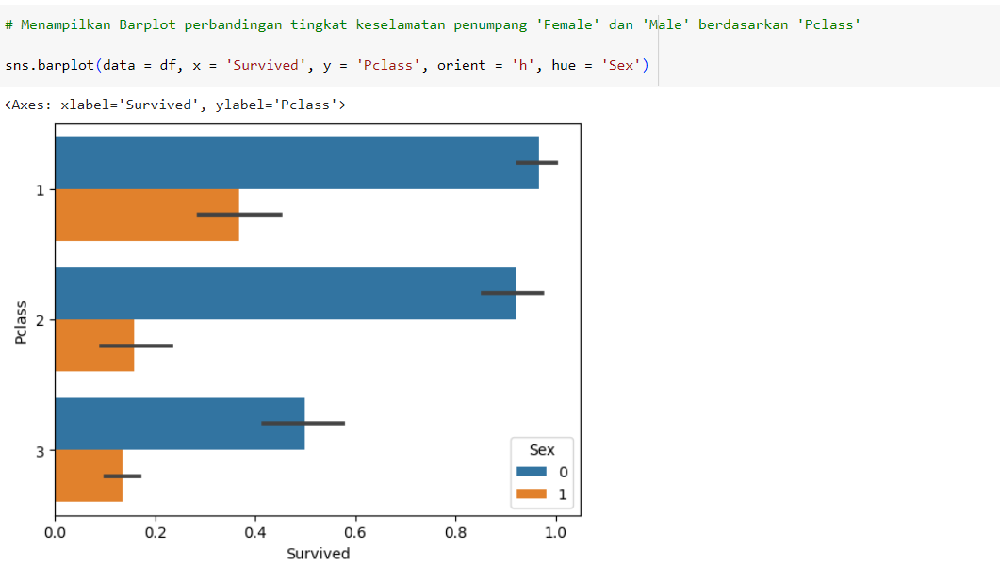

# Portfolio

## Data Analytics with Python 
### Data Cleansing

Data cleansing is an essential process for preparing raw data for machine learning (ML) and business inteligence (BI) applications. Data cleansing is the process of fixing or removing incorrect, corrupted, incorrectly formatted, duplicate, or incomplete data within a dataset. In this project, the data used is Telco Customer Churn Dataset from Kaggle.

 
The steps that were taken in data cleansing included:  
1. Missing value checking and handling, using fill method with median value. 
2. Categorical data encoding, using Label Encoding and Frequently Encoding. 
3. Anomalies and Outliers Handling. In this dataset, no anomalies or outliers were found.

### Data Manipulation with Pandas 

Data manipulation is the process of organizing data to make it more understandable. Data manipulation usually using Pandas library for join, merge, concat, and append the dataset. Before performing data visualization, data cleansing is first carried out on the dataset.

### Data Visualization

Data visualization is the graphical representation of the data using visual elements like charts, graph, and maps. In this project, there will be visualized as barplot, distribution plot, boxplot, scatterplot, and pie chart using Seaborn and Matplotlib libraries. The data used is Titanic Dataset form Kaggle.

### Statistics with Python

Statistics in data analytics helps make meaningful conclusion from raw and unstructured data. The conclusion that are made is used to helping businesses make future predictions on the basis of past trend. Using Diabetes dataset, statistical values (such as mean, median, mode, etc) and visualization of the dataset will be perfomed to facilitate decision-making.

### Exploratory Data Analysis

Exploratory Data Analysis is the process of describing the data by means of statistical analysis and visualization techniques for deeper analytics in data analytics. Using Telco Customer Churn Dataset, Exploratory Data Analysis is well done with the following steps:

1. Data understanding, including data cleansing and data manipulation. 
2. Statistical summary, showing statistical values from dataset. 
3. Univariate analysis for numerical variables by pointing out boxplot, distribution plot, and countplot. 
4. Bivariate analysis for numerical variables by pointing out boxplot and countplot. 
5. Multivariate analysis for numerical variables by pointing out correlation heatmap and category plot.

### Regression and Cluster Modeling

1. Regression 

Regression is a statistical method that attempts to determine the strength and character of the relationship between dependent variable (usually denoted by Y) and a series of other variables (known as independent variables). Using House Prices - Advanced Regression Techniques Dataset, regression modeling is carried out with the following steps:

1. Exploratory Data Analysis. 
2. Split the dataset into two parts, train and test data. 
3. Create a predictive model with linear regression using train data. 
4. Evaluate the predictive model that are made using R-Squared, Mean Absolute Error (MAE), Root Mean Squared Error (RMSE), and Mean Absolute Percentage Error (MAPE). 
  

  
2. Cluster using K-Means CLustering 

K-Means Clustering is an iterative algorithm that tries to partition the dataset into Kpre-defined distinct non-overlapping subgroups (clusters) where each data point belongs to only one group. Using Mall Customers Dataset, clustering is carried out with the following steps:

1. Exploratory Data Analysis. 
2. Determining the number of clusters with Elbow method and Silhouette method. 
3. Perform clustering. 
4. Evaluate the cluster that are made using silhouette coefficient, calinski-harabasz index, dan davies-bouldin index.

  

---
## Machine Learning Visualizations (Data: E-Commerce Shipping Data)

Machine learning is a branch of artificial intelligence (AI) and computer science which focuses on the use of data and algorithms to imitate the way that humans learn, gradually improving its accuracy. With the help of data visualization, we can see how the data looks like and what kind of correlation is held by the attributes of data. It is the fastest way to see if the features correspond to the output. 

---
## GUI Python for Exponential Smoothing

**Exponential Smoothing:** 

 Exponential Smoothing is a time series method for forecasting univariate time series data. Time series methods work on the principle that a prediction is a weighted linear sum of past observations or lags. The Exponential Smoothing time series method works by assigning exponentially decreasing weights for past observations. It is called so because the weight assigned to each demand observation is exponentially decreased. These GUI tools can be helpful for exploring your data and understanding the results of Exponential Smoothing.

 
The steps to Use the Exponential Smoothing GUI 
1. Click the Pilih File button 
2. Input file or data 
3. Click the Hitung button

 

 

 

---
