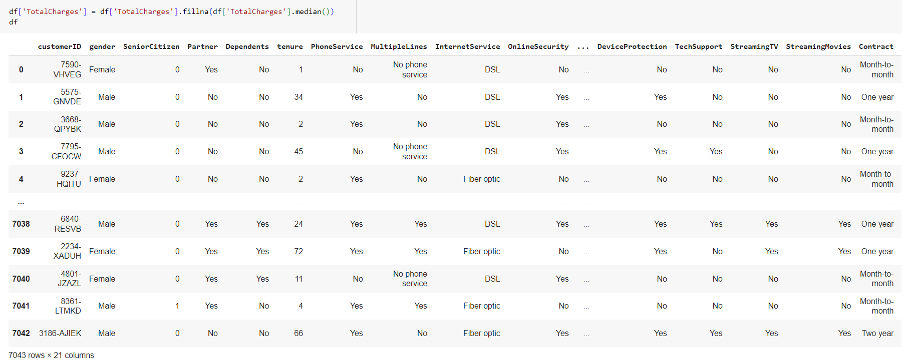

# Portfolio

## Data Analytics with Python 
### Data Cleansing

Data cleansing is an essential process for preparing raw data for machine learning (ML) and business inteligence (BI) applications. Data cleansing is the process of fixing or removing incorrect, corrupted, incorrectly formatted, duplicate, or incomplete data within a dataset. In this project, the data used is Telco Customer Churn Dataset from Kaggle.

 
The steps that were taken in data cleansing included:  
1. Missing value checking and handling, using fill method with median value. 
2. Categorical data encoding, using Label Encoding and Frequently Encoding. 
3. Anomalies and Outliers Handling. In this dataset, no anomalies or outliers were found.

---
### Data Manipulation with Pandas 

Data manipulation is the process of organizing data to make it more understandable. Data manipulation usually using Pandas library for join, merge, concat, and append the dataset.

---
### Data Visualization

Data visualization is the process of organizing data to make it more understandable. Data manipulation usually using Pandas library for join, merge, concat, and append the dataset.

## Machine Learning Visualizations (Data: E-Commerce Shipping Data)

Machine learning is a branch of artificial intelligence (AI) and computer science which focuses on the use of data and algorithms to imitate the way that humans learn, gradually improving its accuracy. With the help of data visualization, we can see how the data looks like and what kind of correlation is held by the attributes of data. It is the fastest way to see if the features correspond to the output. 

---
## GUI Python for Exponential Smoothing

**Exponential Smoothing:** 

 Exponential Smoothing is a time series method for forecasting univariate time series data. Time series methods work on the principle that a prediction is a weighted linear sum of past observations or lags. The Exponential Smoothing time series method works by assigning exponentially decreasing weights for past observations. It is called so because the weight assigned to each demand observation is exponentially decreased. These GUI tools can be helpful for exploring your data and understanding the results of Exponential Smoothing.

 
The steps to Use the Exponential Smoothing GUI 
1. Click the Pilih File button 
2. Input file or data 
3. Click the Hitung button

 

 

 

---
